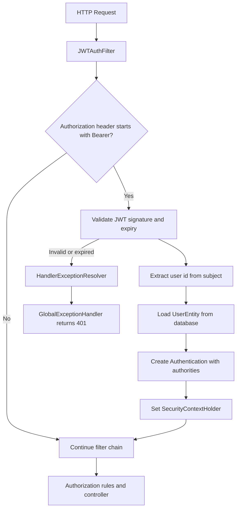
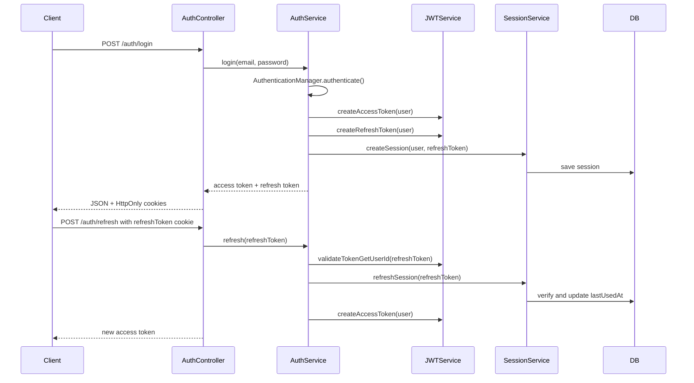
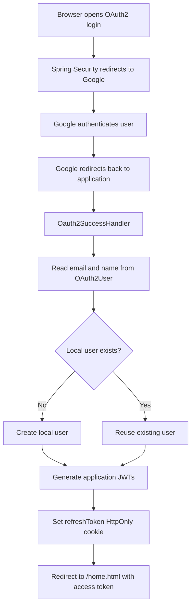
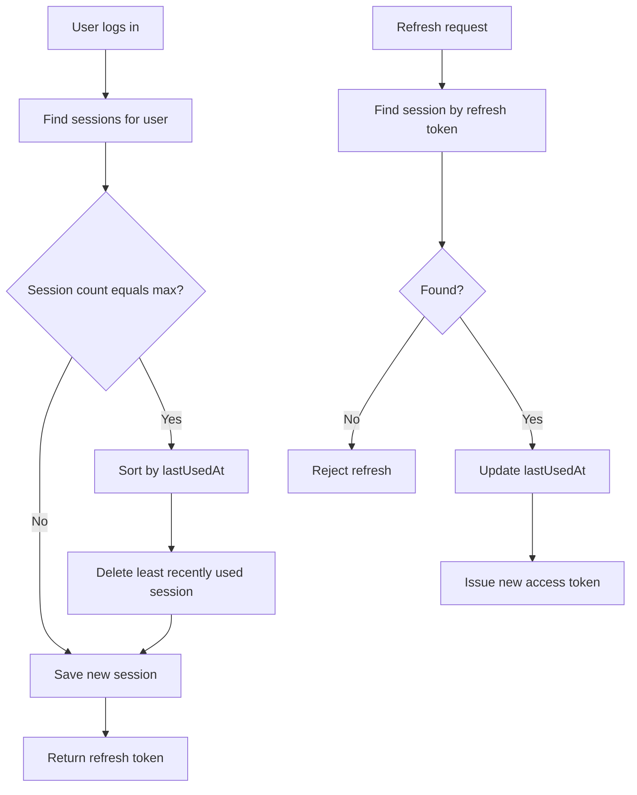
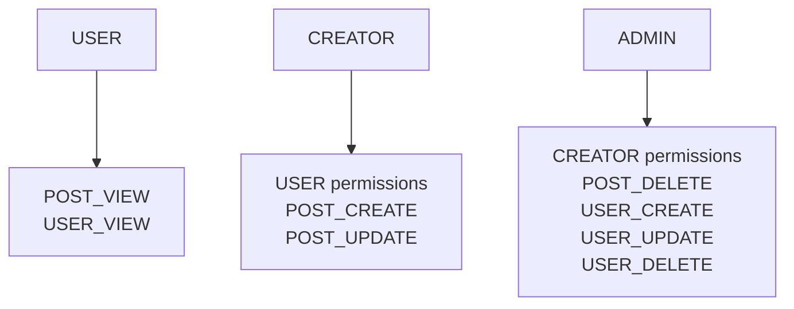
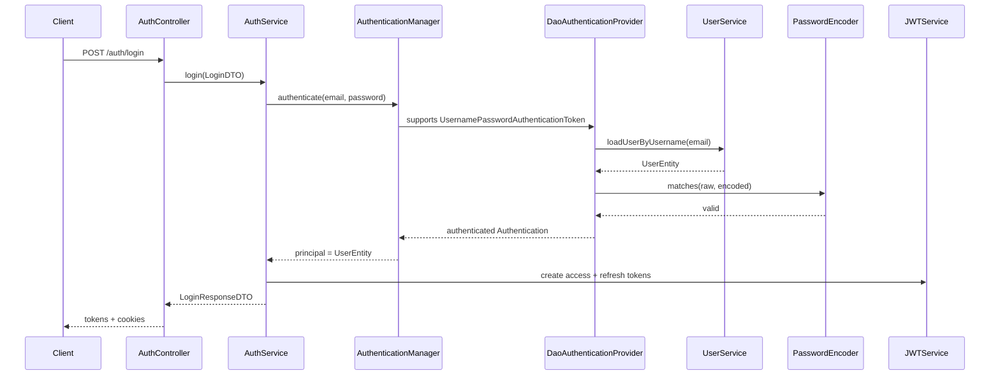
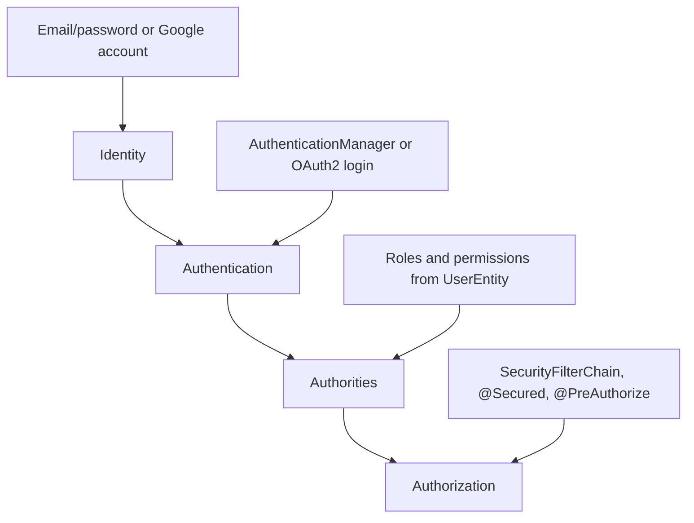

# Spring Security Demo

This repository is an incremental Spring Security learning project. It starts from Spring Boot security defaults, moves through database-backed authentication, JWT-based stateless APIs, refresh tokens, OAuth2 login, session tracking, and ends with role/permission based authorization using method security.

The final application protects a small Posts API and Auth API while demonstrating how Spring Security's authentication pipeline, JWT filters, `SecurityContextHolder`, `UserDetailsService`, `AuthenticationManager`, OAuth2 login, and RBAC fit together.

## What This Project Covers

- Spring Security default behavior after adding `spring-boot-starter-security`
- `SecurityFilterChain` customization
- In-memory users and database-backed users
- `UserDetailsService` integration with `DaoAuthenticationProvider`
- Password hashing with `BCryptPasswordEncoder`
- Signup and login endpoints
- JWT access token generation and validation
- Custom `OncePerRequestFilter` for JWT authentication
- Reading authenticated user data from `SecurityContextHolder`
- Centralized handling of authentication and JWT exceptions
- Refresh token flow
- HttpOnly cookies for access and refresh tokens
- OAuth2 login with Google
- OAuth2 success handler, failure redirect, and frontend redirect
- Refresh-token-backed session records
- Maximum active session limit with least-recently-used eviction
- Role based access control
- Permission based access control
- Mapping roles to permissions
- Method-level authorization with `@Secured` and `@PreAuthorize`
- Ownership checks through a custom Spring bean in SpEL
- Avoiding large request matcher configurations by keeping authorization near business methods

## Tech Stack

- Java 21
- Spring Boot 4.1.0
- Spring Web MVC
- Spring Security
- Spring Data JPA
- MySQL
- OAuth2 Client
- JJWT `0.13.0`
- ModelMapper
- Lombok

## Project Structure

```text
src/main/java/com/shubh/module5/Spring_Security_Demo
+-- advice
|   +-- ApiError.java
|   +-- GlobalExceptionHandler.java
+-- config
|   +-- AppConfig.java
|   +-- WebSecurityConfig.java
+-- controller
|   +-- AuthController.java
|   +-- PostController.java
+-- dto
+-- entity
|   +-- PostEntity.java
|   +-- Session.java
|   +-- UserEntity.java
|   +-- enums
|       +-- Permission.java
|       +-- Role.java
+-- filter
|   +-- JWTAuthFilter.java
+-- handlers
|   +-- Oauth2SuccessHandler.java
+-- repository
+-- service
|   +-- AuthService.java
|   +-- JWTService.java
|   +-- SessionService.java
|   +-- UserService.java
|   +-- impl
+-- utils
    +-- PostSecurityService.java
    +-- RolePermissionMapper.java
```

## Learning Timeline From Commits

### 1. Spring Security Setup

Commits:

- `d5f0f01` Initialising Project and Adding Spring Security Dependency
- `c10afa0` Adding a single user with some roles in yaml
- `5d1c1dc` Adding User Entity with db authentication functionality via service layer
- `5c85861` basics of security filter chain
- `fbf4342` Registering Multiple Users using InMemoryUserDetailsService bean
- `4f8fe07` Security Filter Chain Stateless Mode

What was learned:

- Adding Spring Security immediately protects all endpoints by default.
- A default login page and generated password are provided unless overridden.
- A simple user can be configured in `application.yaml` using `spring.security.user`.
- Multiple users can be registered with an `InMemoryUserDetailsManager`.
- A custom `SecurityFilterChain` controls which routes are public, authenticated, or restricted.
- Stateless APIs should use `SessionCreationPolicy.STATELESS`.
- Database-backed authentication begins by creating a `UserEntity`, `UserRepository`, and `UserDetailsService`.

### 2. Database Authentication And Login

Commits:

- `bed117a` Adding Login and SignUp Functionality
- `02668a5` Sending token as cookie alongwith response in login
- `dbd51da` reformat
- `9f2d02f` Custom JWT Auth Filter to authenticate all routes except for auth
- `41826ff` Getting User Details from Security Filter Context
- `c4717c6` reformat
- `61e3d8e` Handling Authentication and JWT Exceptions

What was learned:

- `UserService` implements `UserDetailsService`.
- Spring Security calls `loadUserByUsername()` during username/password login.
- The login principal is email, and it maps to the user entity's `email` field.
- `AuthenticationManager.authenticate(...)` delegates to a provider such as `DaoAuthenticationProvider`.
- `DaoAuthenticationProvider` loads the user and checks the raw password against the stored BCrypt hash.
- Signup must hash the raw password before saving it.
- Authentication exceptions should return clear API errors instead of default HTML/login behavior.
- A custom JWT filter must manually delegate exceptions to `HandlerExceptionResolver` because filter exceptions occur before controller advice normally runs.

### 3. JWT Authentication

Commits:

- `76e4b96` Basics Of JWT Authentication
- `9f2d02f` Custom JWT Auth Filter to authenticate all routes except for auth
- `61e3d8e` Handling Authentication and JWT Exceptions

What was learned:

- JWTs are signed with a secret key. For HS256-style signing, the secret must be long enough.
- The token subject stores the user id.
- Access tokens can include useful claims such as email and roles.
- A JWT filter should:
  - Read the `Authorization` header.
  - Continue the chain if the header is missing or does not start with `Bearer `.
  - Validate the token signature and expiration.
  - Load the user from the database.
  - Create a `UsernamePasswordAuthenticationToken`.
  - Include the user's authorities.
  - Store authentication in `SecurityContextHolder`.
  - Continue the filter chain.



### 4. Security Context

Commits:

- `41826ff` Getting User Details from Security Filter Context
- `557d5ba` RBAC: Fine Grained Access Control and avoid request matcher bloat using `@PreAuthorize` and `@Secure`

What was learned:

- Once the JWT filter sets the authenticated principal, services and authorization helpers can read it from `SecurityContextHolder`.
- The principal is a `UserEntity` only after authentication succeeds.
- If an endpoint is public, Spring may use an anonymous principal like `"anonymousUser"`, so direct casting to `UserEntity` is only safe behind authenticated routes.
- Spring Security stores the context per request, internally using thread-local context.

### 5. Refresh Token Flow

Commits:

- `f2c3007` Adding Support for refreshing jwt token upon expiry

What was learned:

- Short-lived access tokens reduce the damage of token leakage.
- Refresh tokens are longer lived and are used only to obtain new access tokens.
- Refresh endpoints should validate:
  - The refresh token signature.
  - The refresh token expiration.
  - Whether the refresh token still represents an active server-side session.
- The project returns access and refresh tokens in the login response and also stores them in HttpOnly cookies.



### 6. Cookie Security

Commits:

- `02668a5` Sending token as cookie alongwith response in login
- `f2c3007` Adding Support for refreshing jwt token upon expiry
- `b1b2445` OAuth Flow: Failure, Success Handler, Redirects

What was learned:

- `HttpOnly` cookies prevent JavaScript from reading tokens through `document.cookie`.
- This helps reduce token theft risk during XSS incidents.
- `HttpOnly` does not mean HTTPS-only.
- `Secure` cookies should be enabled in production so cookies are sent only over HTTPS.
- This project controls secure cookie behavior using `deployment.env`.

### 7. OAuth2 Login

Commits:

- `ba560fa` Adding Oauth2 Client Dependency along with client-id and secret in yaml
- `b92c130` removed devtools: A class-loading issue caused by the DevTools restart classloader
- `b1b2445` OAuth Flow: Failure, Success Handler, Redirects

What was learned:

- OAuth2 client support comes from `spring-boot-starter-oauth2-client`.
- Provider credentials are configured under `spring.security.oauth2.client.registration`.
- Google login verifies the user's identity, but the application still issues its own JWTs afterward.
- A custom `Oauth2SuccessHandler` can:
  - Read the OAuth2 user's email and name.
  - Create a local user if one does not exist.
  - Generate application access and refresh tokens.
  - Store the refresh token in an HttpOnly cookie.
  - Redirect the browser to a frontend success page.
- OAuth failure can redirect to a login error URL.
- DevTools restart classloader can cause class-loading surprises with security/OAuth classes, so it was removed.



### 8. Stateful Refresh Sessions

Commits:

- `f771064` Added a Session Table to prevent session abuse with max_session_limit and lru session eviction

What was learned:

- Pure JWT access tokens are stateless, but refresh-token tracking can intentionally add server-side state.
- A `Session` table stores refresh tokens associated with users.
- Every login creates a new refresh-token session.
- The maximum active session count is capped at `2`.
- When the limit is reached, the least recently used session is evicted.
- Refreshing a token updates `lastUsedAt`, making active sessions survive longer than stale ones.



### 9. RBAC Basics

Commits:

- `74e7718` RBAC BASICS
- `b80d24b` RBAC: Adding Permissions along with roles. Check Request Matcher Precedence behaviour
- `58b76ac` RBAC: Linking Permissions with roles, production behaviour
- `557d5ba` RBAC: Fine Grained Access Control and avoid request matcher bloat using `@PreAuthorize` and `@Secure`

What was learned:

- Roles and authorities are related but not identical in Spring Security.
- `hasRole("ADMIN")` checks for an authority named `ROLE_ADMIN`.
- `hasAuthority("POST_VIEW")` checks the exact authority value.
- `@Secured` requires the full role authority name, such as `ROLE_ADMIN`.
- Permissions can be mapped from roles and returned as `GrantedAuthority` values.
- Endpoint matcher order matters: more specific matchers should come before broader ones.
- Large authorization rules inside `SecurityFilterChain` become hard to maintain.
- A cleaner pattern is:
  - Keep route-level rules simple: public vs authenticated.
  - Put business authorization near the method with `@Secured` or `@PreAuthorize`.

Current role hierarchy:



Authorization flow:

```mermaid
flowchart TD
    A[HTTP Request] --> B[JWTAuthFilter]
    B --> C[SecurityContextHolder populated]
    C --> D[SecurityFilterChain]
    D --> E{Route public?}
    E -- Yes --> F[Controller]
    E -- No --> G{Authenticated?}
    G -- No --> H[401 Unauthorized]
    G -- Yes --> F
    F --> I[@Secured / @PreAuthorize]
    I --> J{Allowed?}
    J -- Yes --> K[Service method]
    J -- No --> L[403 Forbidden]
```

### 10. Ownership Checks With SpEL

Commit:

- `557d5ba` RBAC: Fine Grained Access Control and avoid request matcher bloat using `@PreAuthorize` and `@Secure`

What was learned:

- `@PreAuthorize` supports Spring Expression Language.
- Custom beans can be called from SpEL with `@beanName.method(...)`.
- Method parameters can be referenced with `#parameterName`.
- `PostSecurityService.isOwnerOfPost(postId)` checks whether the authenticated user owns the requested post.

Example:

```java
@PreAuthorize("@postSecurityService.isOwnerOfPost(#id)")
public PostDTO getPostById(@PathVariable Long id) {
    return postService.getPostById(id);
}
```

## Final Architecture

```mermaid
flowchart LR
    Client[Client] --> AuthController[AuthController]
    Client --> PostController[PostController]

    AuthController --> AuthService[AuthService]
    AuthService --> AuthenticationManager[AuthenticationManager]
    AuthenticationManager --> UserService[UserService / UserDetailsService]
    UserService --> UserRepository[UserRepository]
    AuthService --> JWTService[JWTService]
    AuthService --> SessionService[SessionService]
    SessionService --> SessionRepository[SessionRepository]

    Client --> JWTAuthFilter[JWTAuthFilter]
    JWTAuthFilter --> JWTService
    JWTAuthFilter --> UserService
    JWTAuthFilter --> SecurityContext[SecurityContextHolder]

    PostController --> MethodSecurity[@Secured / @PreAuthorize]
    MethodSecurity --> PostSecurityService[PostSecurityService]
    PostController --> PostService[PostService]
    PostService --> PostRepository[PostRepository]

    OAuthProvider[Google OAuth2] --> Oauth2SuccessHandler[Oauth2SuccessHandler]
    Oauth2SuccessHandler --> UserRepository
    Oauth2SuccessHandler --> JWTService
```

## Key Classes

| Class | Responsibility |
| --- | --- |
| `WebSecurityConfig` | Defines public routes, authenticated routes, stateless behavior, JWT filter placement, OAuth2 login, and method security. |
| `AppConfig` | Registers shared beans such as `ModelMapper` and `BCryptPasswordEncoder`. |
| `UserService` | Implements `UserDetailsService`, signs up users, loads users by email, and finds users by id. |
| `AuthService` | Performs login, delegates authentication to `AuthenticationManager`, creates JWTs, and refreshes access tokens. |
| `JWTService` | Creates and validates access and refresh JWTs. |
| `JWTAuthFilter` | Extracts bearer tokens, validates JWTs, loads users, and populates `SecurityContextHolder`. |
| `SessionService` | Stores refresh-token sessions, enforces max session count, and updates session usage. |
| `Oauth2SuccessHandler` | Handles successful Google login and bridges OAuth identity into application JWTs. |
| `UserEntity` | Implements `UserDetails` and converts roles/permissions into Spring Security authorities. |
| `RolePermissionMapper` | Maps application roles to permissions. |
| `PostSecurityService` | Performs post ownership authorization checks for `@PreAuthorize`. |
| `GlobalExceptionHandler` | Converts resource, authentication, JWT, and access denied exceptions into API responses. |

## API Overview

### Auth

| Method | Endpoint | Description | Auth |
| --- | --- | --- | --- |
| `POST` | `/auth/signup` | Create a user with encoded password and roles. | Public |
| `POST` | `/auth/login` | Authenticate email/password, issue access and refresh tokens. | Public |
| `POST` | `/auth/refresh` | Use refresh token cookie to issue a new access token. | Public route, validates refresh token |

### Posts

| Method | Endpoint | Description | Authorization idea |
| --- | --- | --- | --- |
| `GET` | `/posts` | List posts. | Users with `ROLE_ADMIN` or `POST_VIEW` authority. |
| `GET` | `/posts/{id}` | Read one post. | Owner check through `PostSecurityService`. |
| `POST` | `/posts` | Create a post. | `ROLE_ADMIN` or `ROLE_CREATOR` via `@Secured`. |

## Authentication Flow



## Request Authorization Strategy

The final design separates authentication and authorization:

1. `SecurityFilterChain` decides whether a request is public or must be authenticated.
2. `JWTAuthFilter` authenticates bearer-token requests by populating `SecurityContextHolder`.
3. Controller methods use `@Secured` and `@PreAuthorize` for business-specific authorization.
4. Custom authorization logic lives in a Spring bean such as `PostSecurityService`.

This avoids request matcher bloat. Instead of writing every role/permission rule in `WebSecurityConfig`, each business method carries the rule that protects it.

## Configuration Notes

`application.yaml` currently configures:

- MySQL datasource at `jdbc:mysql://localhost:3306/Spring_Security_Demo`
- Hibernate `ddl-auto: update`
- SQL logging
- One fallback Spring Security user
- Google OAuth2 client registration using environment variables:
  - `${google-client-id}`
  - `${google-client-secret}`
- JWT secret key
- `deployment.env`, used for production-only secure cookies

## Running Locally

Prerequisites:

- Java 21
- Maven wrapper support
- MySQL running locally
- A database named `Spring_Security_Demo`
- Google OAuth client id/secret if testing OAuth login

Run:

```bash
./mvnw spring-boot:run
```

For OAuth, provide the client values as environment variables or VM options:

```bash
google-client-id=...
google-client-secret=...
```

## Important Implementation Notes

- Access tokens currently expire very quickly for learning purposes.
- Refresh tokens are also short-lived for easier testing.
- The refresh token is stateful because it is stored in the `Session` table.
- The app uses enum roles and permissions. This is suitable for a learning project, but production systems often model roles and permissions as database entities.
- `@ElementCollection` is used for user roles because roles are enum values, not independent role entities.
- `AccessDeniedException` is handled explicitly so REST APIs return JSON `403 Forbidden` instead of redirecting to an OAuth login page.
- `HandlerExceptionResolver` is used in `JWTAuthFilter` so JWT exceptions thrown before MVC controllers still reach `@RestControllerAdvice`.
- `PostController#getAllPosts` demonstrates composing role and permission checks in one method-level rule. `hasRole('ADMIN')` checks for `ROLE_ADMIN`, while `hasAuthority('POST_VIEW')` checks the exact permission authority:

```text
@PreAuthorize("hasRole('ADMIN') or hasAuthority('POST_VIEW')")
```

## Commit Summary

| Commit | Learning step |
| --- | --- |
| `d5f0f01` | Added Spring Security and initial protected application. |
| `c10afa0` | Learned YAML-based default user configuration. |
| `5d1c1dc` | Added DB user entity, repository, and service. |
| `5c85861` | Introduced custom `SecurityFilterChain`. |
| `fbf4342` | Added multiple in-memory users. |
| `4f8fe07` | Switched toward stateless security. |
| `c50d14f` | Renamed base package. |
| `76e4b96` | Added basic JWT generation and validation. |
| `bed117a` | Added signup and login. |
| `02668a5` | Started sending tokens as cookies. |
| `9f2d02f` | Added custom JWT authentication filter. |
| `41826ff` | Read authenticated user from the security context. |
| `61e3d8e` | Centralized auth and JWT exception handling. |
| `f7e4f75` | Documented login principal mapping. |
| `68d5f13` | Documented signup/password verification behavior. |
| `f2c3007` | Added refresh token support. |
| `ba560fa` | Added OAuth2 client dependency and Google client config. |
| `b92c130` | Removed DevTools due to classloader issues. |
| `b1b2445` | Added OAuth2 success handler, redirects, and frontend success page. |
| `f771064` | Added session table, max sessions, and LRU eviction. |
| `74e7718` | Added RBAC basics. |
| `b80d24b` | Added permissions and explored matcher precedence. |
| `58b76ac` | Linked permissions with roles. |
| `557d5ba` | Moved fine-grained authorization to method security. |

## Mental Model

Spring Security in this project can be understood as four layers:



- Identity answers: who is trying to access the system?
- Authentication answers: can we prove this identity?
- Authorities answer: what roles and permissions does this user have?
- Authorization answers: is this user allowed to perform this action?
